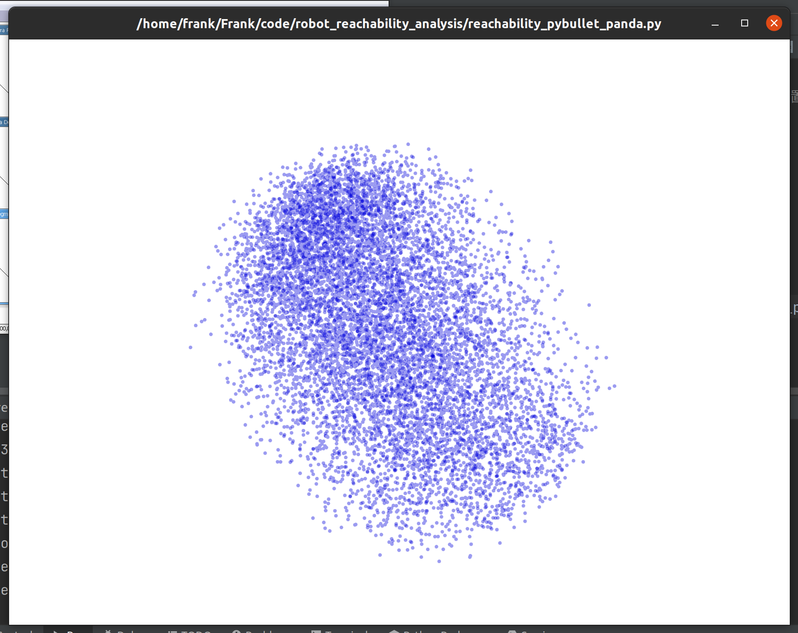

# 可达性仿真 - Panda 与 UR 机械臂

本项目包含两个 Python 脚本，用于使用 PyBullet 和 Trimesh 库在 3D 仿真环境中展示 Franka Panda 和 UR10 机械臂的可达空间。通过随机采样关节角度空间，计算并可视化机械臂末端执行器在空间中的可达位置，并展示机械臂轮廓。

## 文件说明

1. `reachability_pybullet_panda.py`: 该脚本用于仿真和可视化 Franka Panda 机械臂的可达空间。
2. `reachability_pybullet_ur.py`: 该脚本用于仿真和可视化 UR10 机械臂的可达空间。

## 使用方法

### 环境要求
- Python 3.10
    ```bash
    pip install numpy==2.1.2 pybullet==3.2.6 trimesh==4.5.1
    ```
### 执行步骤
1. 将 `panda.urdf` 或 `ur10.urdf` 文件放置在相应路径下。
2. 运行相应的脚本，例如：
   ```bash
   python reachability_pybullet_panda.py
   ```
   或
   ```bash
   python reachability_pybullet_ur.py
   ```
3. 脚本会启动 PyBullet GUI，用于展示机械臂模型。
4. Trimesh 窗口会展示机械臂的 3D 可达空间点云（蓝色）和机械臂轮廓（红色）。

### 参数说明
- `num_samples`: 用于控制随机采样的数量，影响可达空间点云的密集程度。
- `reachability_points`: 存储可达空间的 3D 点坐标。
- `arm_points`: 存储机械臂的关节点位置。

### 可视化
脚本会生成以下可视化内容：
- 蓝色半透明的可达空间点云，表示末端执行器在随机采样关节空间下的所有可达位置。
- 红色机械臂轮廓点云，展示机械臂各关节在3D空间中的位置。

## 注意事项
- 脚本在运行后会持续显示 PyBullet GUI 和 Trimesh 窗口。执行完毕后可以手动调用 `p.disconnect()` 关闭窗口。
- 使用不同的机械臂模型时，请确保 URDF 文件路径正确。

## 示例
以下是可视化效果的示意图：
- 蓝色点云代表 Panda 或 UR 机械臂的末端执行器可达空间。
- 

## 版权与许可证
本项目基于开源许可，您可以根据需求修改和分发代码。
```